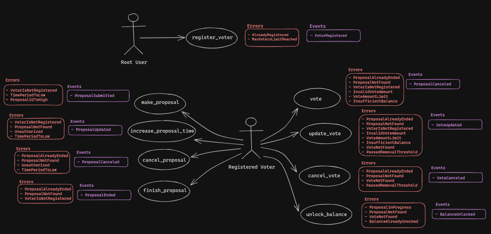

# Week 3 Assignment - Valentin Fernandez
Polkadot Blockchain Academy B.A. - 2023

- [Project Description](#project-description)
- [Diagram](#use-case-diagram)
- [Details](#details)
- [Future Improvements](#future-improvements)
- [Resources](#resurces)

## **Quadratic Voting Pallet**
The chosen project was the Quadratic Voting Pallet, built on Substrate for the Polkadot Blockchain Academy.
### **Project Description**
This project features the implementation of Quadratic Voting. Registered voters can submit proposals on the blockchain for voting by the rest of the voters. 

Proposals include a hash description and a time limit (in blocks) indicating when the proposal ends. 

Voters can vote "Aye" or "Nay" with a specified number of points, where the cost of each point increases quadratically. The cost is reserved from the voter's balance via the **`Reservable Currency`** trait. At any given time, multiple proposals can be ongoing. Upon reaching the time limit, a voter can finish the proposal and calculate the result. After the proposal completion, voters can unlock their reserved balances.

For this there's a list of extrinsics that allows the users tto interact with the state machine in different ways.
  + **Register Users:**
    1. `register_voter(origin, who)`
  + **Proposals:**
    1. `make_proposal(origin, description, time_period)`
    2. `increase_proposal_time(origin,	proposal_id, new_time_period)`
    3. `cancel_proposal(origin, proposal_id)`
    4. `finish_proposal(origin, proposal_id)`
  + **Voting**`
    1. `vote(origin, proposal_id, vote_decision)`
    2. `update_vote(origin, proposal_id, new_vote_decision)`
    3. `cancel_vote(origin, proposal_id)`
    4. `unlock_balance(origin, proposal_id)`

### **Use Case Diagram**

### **Details**
### **Future Improvements**
### **Resources**